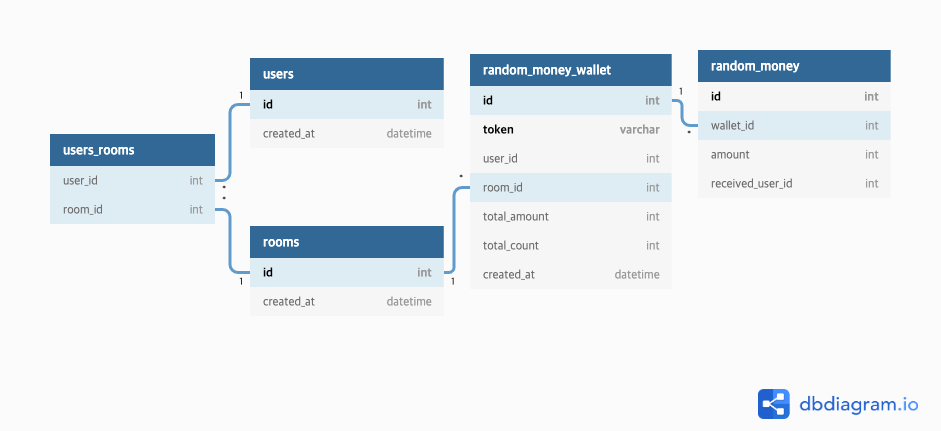

# 카카오페이 머니 뿌리기 API

## 카카오페이 머니 뿌리기?
* 다수의 친구들이 있는 대화방에 뿌릴 머니의 금액과 받는 대상의 숫자를 요청
* 요청시 사용자의 잔액 감소하고, 대화방에는 뿌리기 메시지 발송
* 대화방의 다른 사용자는 발송된 메세지를 통해서 금액을 무작위로 받아감

---

## 프로젝트 구성
* Spring Boot 2.4.0
* Spring Data JPA
* H2 Database
* Spring RestDocs
* Gradle

---

## API 정의
### 공통 HTTP Header
* `X-USER-ID` : `Number` 형태의 사용자 식별값
* `X-ROOM-ID` : `String` 형태의 대화방 식별값
    
### 뿌리기 API
| 구분 | Key | 설명 |
| --- | :---: | :---: |
| **Request Parameter** | totalAmount | 뿌릴 금액 |
|                       | totalCount | 받을 인원수 |
| |
| **Response Parameter** | token | 뿌리기 token |

### 받기 API
| 구분 | Key | 설명 |
| --- | :---: | :---: |
| **Request Parameter** | token | 뿌리기 token |
| |
| **Response Parameter** | amount | 받은 금액 |

### 조회 API
| 구분 | Key | 설명 |
| --- | :---: | :---: |
| **Request Parameter** | token | 뿌리기 token |
| |
| **Response Parameter** | createAt | 뿌리기 시각 |
|                        | totalAmount | 뿌리기 금액 |
|                        | receiveAmount | 받기 완료된 금액 |
|                        | receiveInfo [list] | 받기 완료된 정보 |
|                        | amount | 받은 금액 |
|                        | userId | 받은 사용자 아이디 |

---

## Database Modeling

---

## API 업무 흐름도
### 뿌리기 API
1. `POST /random-money` 요청
2. 받는 대상 인원수만큼의 뿌릴 금액 배분
    * 1 / N
    * 남은 잔돈은 마지막 항목에 추가
3. `token` 생성후 전달
    * `user_id + room_id + 현재시간` => `SHA256` => `hash data 마지막 3자리`
### 받기 API
1. `PUT /random-money` 요청
2. 요청 `token`에 해당하는 뿌리기 항목 중 받지 않은 항목 조회
    * 자신이 요청한 뿌리기인지 확인
    * 이미 받은 뿌리기 항목인지 확인
    * 해당 뿌리기 항목 대화방에 있는 사용자인지 확인
    * 유효시간 10분 확인
3. 받지 않은 항목 중 최상단 항목 1개만 조회 후 업데이트
4. 받은 금액 반환

### 조회 API
1. `GET /random-money` 요청
2. 요청 `token`에 해당하는 뿌리기 항목 전체 조회
    * 뿌리기 등록 7일 이내인지 확인
    * 본인이 뿌리기한 요청인지 확인
    * 유효한 토큰인지 확인

    **응답 데이터 정리**
    * 뿌리기 등록한 시각
    * 뿌리기 전체 금액
    * 뿌리기 받은 금액
    * 뿌리기 받은 정보 리스트
        * 받은 금액
        * 받은 사용자 ID

---

